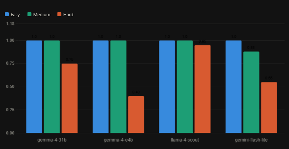

# ap-invoice-env

Real-world Accounts Payable Invoice Processor built as an OpenEnv environment with three graded tasks: `easy`, `medium`, and `hard`.

This benchmark models the kind of invoice triage work AP teams actually do: review invoice details, assign a category, run policy checks, detect suspicious payment requests, and choose the correct final disposition.

## Why This Is Useful

- It models a real back-office workflow instead of a toy task.
- It provides partial-progress reward over the full trajectory.
- It distinguishes routine approvals, policy rejects, and fraud review.
- It exposes deterministic rules so agents are evaluated on workflow quality, not hidden strings.

## Action Space

The agent sends a typed `InvoiceAction` with:

- `type`: `list_invoices`, `view_invoice`, `categorize`, `validate`, `approve`, `reject`, `flag_fraud`, or `close`
- `invoice_id`: optional invoice identifier for invoice-specific actions
- `category`: optional category label for `categorize`
- `notes`: optional notes field

## Observation Space

Each step returns a typed `InvoiceObservation` with:

- `message`: feedback for the last action
- `invoices_summary`: invoice list with AP-relevant business fields and workflow status
- `current_invoice`: the currently opened invoice, if any
- `valid_categories`: the accepted category labels for `categorize`
- `policy_rules`: the benchmark rules the agent should follow
- `reward`: shaped step reward
- `done`: whether the episode has ended
- `progress`: normalized score in `[0, 1]`
- `last_action_error`: raw action error text or `null`
- `metadata`: task name, objective, step count, and reward totals

## Valid Categories

- `office_supplies`
- `software`
- `meals`
- `hardware`
- `logistics`
- `services`
- `marketing`
- `facilities`

## Policy Rules

- Invoices above 500 USD require a purchase order before approval.
- Future-dated invoices and negative invoice amounts must be rejected.
- Unexpected bank-change requests or urgent wire wording should be flagged for fraud.
- A complete review should inspect, categorize, validate, and then finalize each invoice.

## Tasks

- `easy`: 3 routine invoices that should all be approved after normal review.
  Difficulty rationale: tests the happy-path AP workflow and correct category usage.
- `medium`: 4 invoices with one policy-violating but non-fraud invoice that must be rejected.
  Difficulty rationale: introduces business-rule reasoning rather than simple approve-all behavior.
- `hard`: 5 invoices mixing approvals, policy rejects, and subtle fraud signals.
  Difficulty rationale: requires differentiating suspicious payment behavior from ordinary invalid invoices.

## Reward Design

- Positive reward is given for first-time workflow progress such as opening an invoice, correct categorization, validation, and correct final disposition.
- Partial progress contributes to the final `progress` score: category, validation, and correct resolution all matter.
- Repeating the exact same action, re-listing the inbox, reopening the same invoice, or closing early is penalized.
- Episodes end when all invoices are finalized, `max_steps` is reached, or the agent explicitly closes the episode.

## Quick Start

```bash
uv venv
uv pip install -e .[dev]
uv run uvicorn server.app:app --reload --port 8000
```

Create a local env file first:

```powershell
Copy-Item .env.example .env
```

`inference.py` auto-loads values from `.env` if that file exists.

If the evaluator launches `python inference.py` in a partially prepared environment, the script can self-bootstrap missing runtime dependencies from the root [`requirements.txt`](P:/Projects/openenv-proj/requirements.txt) before continuing. It prefers the Docker image named by `LOCAL_IMAGE_NAME`, but falls back to the in-process environment implementation if evaluator-side Docker/image wiring is unavailable so the baseline still completes with structured logs.

## Docker

Validator-compatible root build:

```bash
docker build -t ap-invoice-env:latest .
```

Legacy build path also works:

```bash
docker build -f server/Dockerfile -t ap-invoice-env:latest .
```

## Validation

Run the OpenEnv validator before submitting:

```bash
uv run openenv validate
```

## Baseline Inference

The baseline script uses the OpenAI client to request a short per-task review plan, then executes a deterministic guardrailed AP workflow against the environment. This keeps the submission compatible with the hackathon requirement while producing stable, reproducible baseline scores.

```powershell
docker build -t ap-invoice-env:latest .
uv run python inference.py # to run all of the tasks
$env:MY_ENV_TASK="easy"; python inference.py
$env:MY_ENV_TASK="medium"; python inference.py
$env:MY_ENV_TASK="hard"; python inference.py
```

For a clean-machine reproduction of the evaluator path:

```powershell
python -m venv .validator-venv
.\.validator-venv\Scripts\python -m pip install -r requirements.txt
.\.validator-venv\Scripts\python inference.py
```

If `MY_ENV_TASK` is unset or set to `all`, the script runs `easy`, `medium`, and `hard` sequentially.

### Baseline Scores

Measured locally on April 7, 2026 with:

`MODEL_NAME=qwen3.5-4b`
| Task | Steps | Score |
|---|---:|---:|
| easy | 12 | 1.00 |
| medium | 16 | 1.00 |
| hard | 20 | 1.00 |


`MODEL_NAME=gemma-4-31b-it`
| Task | Steps | Score |
|---|---:|---:|
| easy | 12 | 1.00 |
| medium | 20 | 1.00 |
| hard | 25 | 0.75 |

`MODEL_NAME=google/gemma-4-e4b`
| Task | Steps | Score |
|---|---:|---:|
| easy | 12 | 1.00 |
| medium | 17 | 1.00 |
| hard | 23 | 0.40 |

`MODEL_NAME=meta-llama/llama-4-scout-17b-16e-instruct`
| Task | Steps | Score |
|---|---:|---:|
| easy | 18 | 1.00 |
| medium | 18 | 1.00 |
| hard | 25 | 0.95 |

`MODEL_NAME=gemini-3.1-flash-lite-preview`
| Task | Steps | Score |
|---|---:|---:|
| easy | 12 | 1.00 |
| medium | 17 | 0.88 |
| hard | 25 | 0.55 |

### Model benchmark results

| Model | Easy | Medium | Hard | Avg score |
|---|:-:|:-:|:-:|:-:|
| `gemma-4-31b-it` | ✅ 12s | ✅ 20s | 🟡 25s · 0.75 | **0.92** |
| `google/gemma-4-e4b` | ✅ 12s | ✅ 17s | 🔴 23s · 0.40 | **0.80** |
| `meta-llama/llama-4-scout-17b-16e-instruct` | ✅ 18s | ✅ 18s | 🟢 25s · 0.95 | **0.98** |
| `gemini-3.1-flash-lite-preview` | ✅ 12s | 🟡 17s · 0.88 | 🔴 25s · 0.55 | **0.81** |

*Steps shown only where score < 1.00 · ✅ = perfect score · 🟢 ≥ 0.90 · 🟡 ≥ 0.75 · 🔴 < 0.75*



These values were produced by the current `inference.py` using the local Docker image `ap-invoice-env:latest`. 
> NOTE:
Based on our tests, most free open-source “non-thinking” models available on Hugging Face for free inference failed to complete the tasks. Small “thinking” models often get caught in dead loops and generally only complete the easy task while failing the others. Models with reasoning capability and parameter counts above roughly 4B performed most stably and produced the decent scores reported above.
